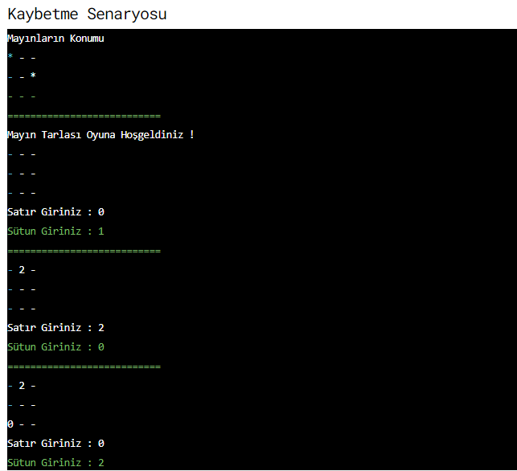
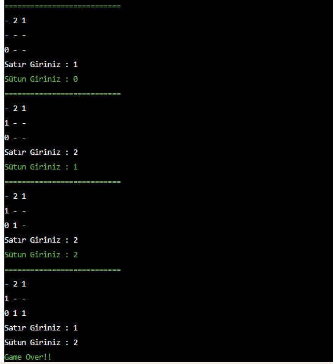
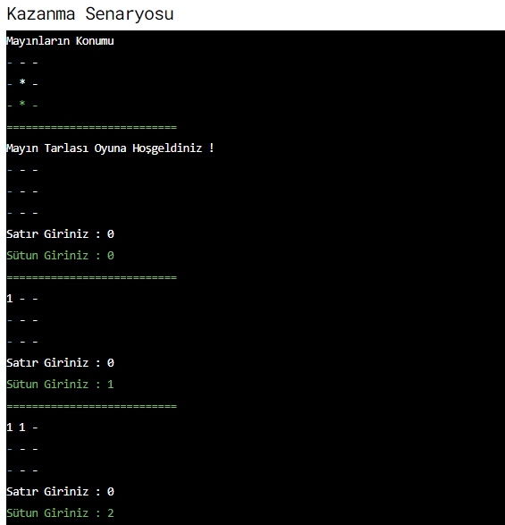
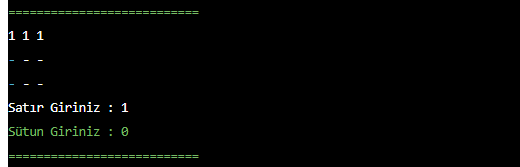
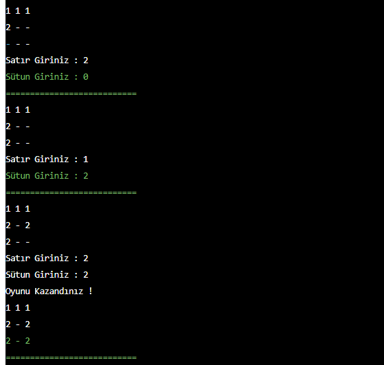

# Task
Bitirme Projesi: Mayın Tarlası Oyunu.

## Task Link
https://app.patika.dev/courses/java101/bitirme-mayin-tarlasi

## Task Description
Java dilinde Mayın Tarlası oyunu yapmanızı bekliyoruz.

Oyun Kuralları :

Oyun metin tabanlıdır.

Çift boyutlu diziler üzerinden oynanmalı ve MineSweeper sınıfı içerisinde tasarlanmalı.

Matris boyutunu yani satır ve sütun sayısını kullanıcı belirlemeli.

Diziye ait eleman sayısının çeyreği (elemanSayisi / 4) kadar rastgele mayın yerleştirilmeli. Örneğin dizi 4x3 boyutunda ise eleman sayısı (satırSayısı * sütunSayısı) formülü ile hesaplanmalı ve boyutu 12 olmalı. Bu durumda mayın sayısı 12 / 4 = 3 adet olmalıdır. (ipucu : bu mayınların konumlarını tutacak ikinci bir dizi oluşturabilirsiniz.)

Kullanıcı matris üzerinden bir nokta seçmeli. Nokta seçimi için satır ve sütun değerlerini girmeli.

Seçilen noktanın dizinin sınırları içerisinde olup olmadığını kontrol edilmeli ve koşul sağlanmazsa tekrar nokta istenmeli.

Kullanıcının girdiği noktada mayın var ise oyunu kaybetmeli.

Mayın yok ise, ilgili noktaya değen tüm konumlarına bakılmalı (sağı, solu, yukarısı, aşağısı, sol üst çapraz, sağ üst çapraz, sağ alt çapraz, sol alt çapraz) ve etrafındaki mayınların sayısının toplamı ilgili noktaya yazılmalı. Noktaya değen herhangi bir mayın yok ise "0" değeri atanmalı.

Kullanıcı hiç bir mayına basmadan tüm noktaları seçebilirse oyunu kazanmalı.

## Notes
ebebek Java & QA & SAP Spartacus Practicum.

## Author
İrfan ALKAN
