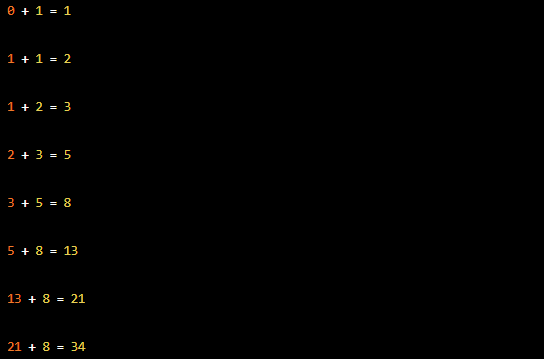

# Task
Fibonacci serisi bulan program.

## Task Link
https://app.patika.dev/courses/java101/odev-fibo

## Task Description
Java döngüler ile fibonacci serisi bulan program yazıyoruz. Fibonacci serisinin eleman sayısını kullanıcıdan alın.

Fibonacci Serisi Nedir ?
Fibonacci serisi, her sayının kendinden önceki ile toplanması sonucu oluşan bir sayı dizisidir. Bu şekilde devam eden bu dizide sayılar birbirleriyle oranlandığında altın oran ortaya çıkar, yani bir sayı kendisinden önceki sayıya bölündüğünde altın orana gittikçe yaklaşan bir dizi elde edilir.

Fibonacci dizisi, 0'dan başlar ve sonsuza kadar. Her rakam, bir önceki rakamla toplanır. Elde edilen sonuç rakamın sağ tarafına yazılır. Fibonacci dizisinin ilk on sayısı şu şekildedir:

9 Elemanlı Fibonacci Serisi : 0 1 1 2 3 5 8 13 21 34

_(! Ödev açıklamasında yukarıda "9 elemanlı" denmiş ama örnek çıktıda 10 eleman mevcut !)_

_( ! Ödev açıklamasında aşağıdaki ekran görüntüsünde 10 değil 8 eleman mevcut ! Fibonacci sayısının ilk iki elemanı olan '0' ve '1' eksik !)_

## Notes
ebebek Java & QA & SAP Spartacus Practicum.

## Author
İrfan ALKAN
