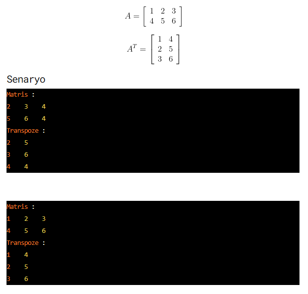

# Task
Matris Transpozunu Bulma Programı.
## Task Link
https://app.patika.dev/courses/java101/odev-array-transpose

## Task Description
Java dilinde, çok boyutlu diziler ile oluşturulmuş matrisin transpozunu bulan programı yazınız.

Matrisin transpozunu (devriğini) almak, matrisin aynı numaralı satırları ile sütunlarının yer değiştirmesi demektir. Bu işlem sonucu elde edilen matris, başlangıçtaki matrisin transpozudur (devriğidir). Bu aşamada kxn’lik bir matrisin transpozu (devriği) nxk’lik bir matris olur. Örneğin bir A matrisimiz olsun. Bu A matrisinin transpozu (devriği), A^T (A üzeri T) ile gösterilir.

Örneğin aşağıdaki 2x3’lik A matrisinin transpozu (devriği), 2x3’lük bir A^T matrisidir.

## Notes
ebebek Java & QA & SAP Spartacus Practicum.

## Author
İrfan ALKAN
