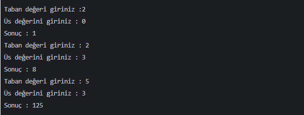

# Task
Recursive Metotlar ile Üslü Sayı Hesaplama

## Task Link
https://app.patika.dev/courses/java101/odev-recursive-power

## Task Description
Recursive Metotlar ile Üslü Sayı Hesaplama. 

Java dilinde, taban ve üs değerleri kullanıcıdan alınan üs alma işlemini "Recursive" metot kullanarak yapan programı yazınız.

Senaryo

## Notes
ebebek Java & QA & SAP Spartacus Practicum.

## Author
İrfan ALKAN
