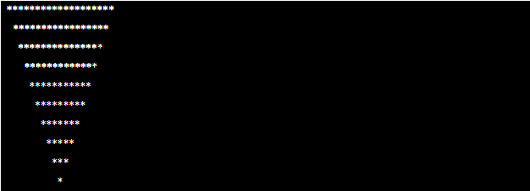

# Task
Basamak sayısı kullanıcıdan alınan ve döngüler kullanılarak, yıldızlar(*) ile ekrana ters üçgen çizen program.

## Task Link
https://app.patika.dev/courses/java101/odev-ters-ucgen

## Task Description
Java ile basamak sayısının kullanıcıdan alınan ve döngüler kullanılarak, yıldızlar(*) ile ekrana ters üçgen çizen programı yazın.

Örnek
Basamak Sayısı : 10

## Notes
ebebek Java & QA & SAP Spartacus Practicum.

## Author
İrfan ALKAN
