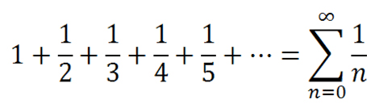

# Task
Dizideki sayıların harmonik ortalamasını hesaplayan program

## Task Link
https://app.patika.dev/courses/java101/pratik-array-ortalama

## Task Description
Dizideki sayıların harmonik ortalamasını hesaplayan programı yazınız.

Harmonik Ortalama formülü : n (eleman sayısı) / elemanların harmonik serisi

Harmonik Seri Formülü :

## Notes
ebebek Java & QA & SAP Spartacus Practicum.

## Author
İrfan ALKAN
