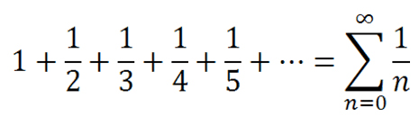

# Task
Girilen sayının harmonik serisini bulan program.

## Task Link
https://app.patika.dev/courses/java101/pratik-harmonic

## Task Description
Java ile girilen sayının harmonik serisini bulan program yazacağız.
Harmonik Seri Formülü :

1 + 1/2 + 1/3 + 1/4 + ... + 1/n

## Notes
ebebek Java & QA & SAP Spartacus Practicum.

## Author
İrfan ALKAN
